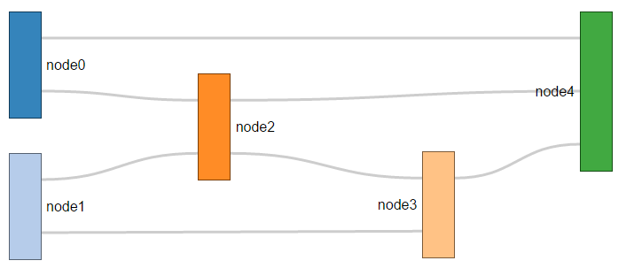

#### Sankey diagram for supply chain

Getting inspiration from :
- how to create a simple sankey diagram http://www.d3noob.org/2013/02/sankey-diagrams-description-of-d3js-code.html
- how to customize the sankey diagram http://csclub.uwaterloo.ca/~n2iskand/?page_id=13
- some d3 basics : https://www.dashingd3js.com/svg-basic-shapes-and-d3js
- maybe needed, some hardcore customization : http://bl.ocks.org/Neilos/584b9a5d44d5fe00f779

## Current look 
