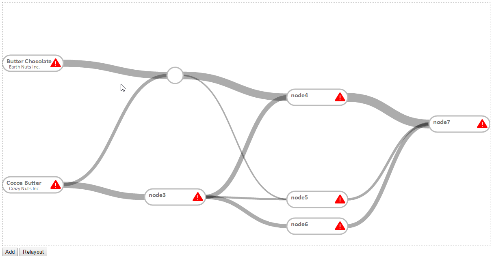

#### Sankey diagram for supply chain

Getting inspiration from :
- how to create a simple sankey diagram http://www.d3noob.org/2013/02/sankey-diagrams-description-of-d3js-code.html
- how to customize the sankey diagram http://csclub.uwaterloo.ca/~n2iskand/?page_id=13
- some d3 basics : http://chimera.labs.oreilly.com/books/1230000000345/ch07.html#_refining_the_plot
- maybe needed, some hardcore customization : http://bl.ocks.org/Neilos/584b9a5d44d5fe00f779
- interesting SO topic : http://stackoverflow.com/questions/26176404/converting-only-certain-nodes-in-d3-sankey-chart-from-rectangle-to-circle

## Current look 

